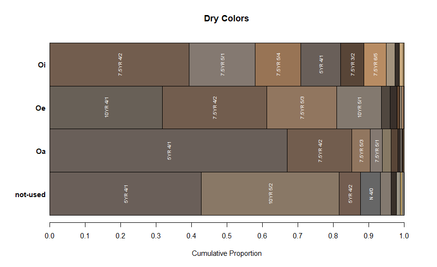

# parse-osd
Code related to parsing of the OSD HTML files.

# Moving to SKB
https://github.com/ncss-tech/SoilKnowledgeBase/pull/26

# Moving Forward
 * convert over to local OSD text file access via [OSDRegistry repo](https://github.com/ncss-tech/OSDRegistry)
 * double-check that output is identical: horizon, site, fulltext, fulltext sections
 * move relevant functions to `soilDB` or `sharpshootR`:
   - getOSD
   - seriesNameToURL
   - getLocalOSD
   - seriesNameToFileName
 * re-factor code to use OSD JSON files via [SoilKnowledgeBase repo](https://github.com/ncss-tech/SoilKnowledgeBase)
 * address existing issues
 * archive old code


# Updates
* 2019-11-18: re-parsed OSDs, missing colors predicted via OLS(value, chroma)
* 2019-05-30: re-parsed OSDs
* 2019-01-28: re-parsed OSDs with latest SC database
* 2018-10-01: re-parsed OSDs with latest SC database
* 2018-07-25: re-parsed OSDs with latest SC database
* 2018-03-14: evaluation of missing color and O horizon color gap-filling
* 2017-08-31: better parsing / searching section data
* 2017-03-10: fixes to color parsing REGEX, B,Y,N hues (mostly) parsed. still issues with "N 3/"
* 2016-10-05: horizon narrative chunks are now saved and available via `soilDB::fetchOSD()`
* 2016-10-04: more chunking, better REGEX, logging of missing (3% have 404 errors) vs. un-parsed OSDs (29 series)
* 2016-02-10: HTML contents are converted to text and appended to a file for fulltext searching, works
* 2016-02-11: chunking the OSDs into sections seems to work
* 2016-02-15: horizon parsing now uses chunked sections.. typos break things, e.g. ["TypicalPedon"](https://soilseries.sc.egov.usda.gov/OSD_Docs/T/TUSKAHOMA.html)
* 2016-03-23: small adjustments to color parsing, should be a little more inclusive

# R
This is the current implementation and always a work in progress. Test REGEX rules here: http://regexr.com/


## OSD Fulltext Searches
Experimental version [here](http://soilmap2-1.lawr.ucdavis.edu/dylan/soilweb/osd-fulltext/).


### Issues
 
#### Stemming / Dictionary Selection
 * "simple" vs "english" dictionary: stemming of words is only useful sometime
 * stemming is counter productive when dealing with soil series names


## Estimation of Missing Dry / Moist Colors
OLS estimation of dry/moist value and chroma.


## Representative O Horizon Colors
Most O horizons in the OSD soil color DB are missing colors. What are some of the most frequently used dry/moist colors for O horizons?


### Dry Colors


|genhz    |munsell.hue | munsell.value| munsell.chroma| munsell.sigma|col     |     red|   green|    blue|  n|
|:--------|:-----------|-------------:|--------------:|-------------:|:-------|-------:|-------:|-------:|--:|
|Oi       |7.5YR       |             4|              2|     0.0270292|#7C6656 | 0.48527| 0.40168| 0.33816| 10|
|Oe       |7.5YR       |             4|              2|     0.0301911|#756659 | 0.46048| 0.40085| 0.34928| 10|
|Oa       |5YR         |             4|              1|     0.0181012|#6E6157 | 0.43050| 0.37866| 0.34310| 10|
|not-used |10YR        |             4|              1|     0.0387446|#786A5F | 0.46932| 0.41666| 0.37299| 10|

### Moist Colors


|genhz    |munsell.hue | munsell.value| munsell.chroma| munsell.sigma|col     |     red|   green|    blue|  n|
|:--------|:-----------|-------------:|--------------:|-------------:|:-------|-------:|-------:|-------:|--:|
|Oi       |7.5YR       |             2|              2|     0.0345739|#47392E | 0.27999| 0.22189| 0.18220| 10|
|Oe       |7.5YR       |             2|              2|     0.0265271|#46362C | 0.27262| 0.21103| 0.17314| 10|
|Oa       |7.5YR       |             2|              1|     0.0128594|#3D322C | 0.23953| 0.19680| 0.17188| 10|
|not-used |10YR        |             2|              1|     0.0378360|#443A30 | 0.26831| 0.22693| 0.18916| 10|


## TODO
  * figure out how to deal with multiple colors
  * combine top+bottom with top only rules, ideas: http://stackoverflow.com/questions/15474741/python-regex-optional-capture-group
  * how can we match neutral colors that are missing a chroma: (N 2.5/)
  * how can we extract mixed horizons?: '3E & Bt' ?
  * typos are very hard to fix [Ackwater](http://casoilresource.lawr.ucdavis.edu/sde/?series=ACKWATER), [TUSKAHOMA](https://soilseries.sc.egov.usda.gov/OSD_Docs/T/TUSKAHOMA.html)
  * typos in Munsell hue may be possible to fix (http://casoilresource.lawr.ucdavis.edu/sde/?series=ACKWATER)

## Examples

### Parsed horizons
```
x <- getOSD('cecil')

# init section REGEX rules
setSectionREGEX('cecil')

# this requires section-splitting
extractHzData(x)

  name top bottom dry_hue dry_value dry_chroma moist_hue moist_value moist_chroma
1   Ap   0     20      NA        NA         NA      10YR           4            4
2  Bt1  20     66      NA        NA         NA       10R           4            8
3  Bt2  66    107      NA        NA         NA       10R           4            8
4   BC 107    127      NA        NA         NA     2.5YR           4            8
5    C 127    203      NA        NA         NA     2.5YR           4            8
```

### Parsed Sections
```
x <- getOSD('cecil')

# init section REGEX rules
setSectionREGEX('cecil')

# extract sections
extractSections(x)

$`BRIEF DESCRIPTION`
[1] "The Cecil series consists of very deep, well drained moderately permeable soils on ridges and side slopes of the Piedmont uplands. They are deep to saprolite and very deep to bedrock. They formed in residuum weathered from felsic, igneous and high-grade metamorphic rocks of the Piedmont uplands. Slopes range from 0 to 25 percent. Mean annual precipitation is 48 inches and mean annual temperature is 59 degrees F. near the type location."

$`TAXONOMIC CLASS`
[1] ": Fine, kaolinitic, thermic Typic Kanhapludults"

$`TYPICAL PEDON`
[1] ": Cecil sandy loam--forested. (Colors are for moist soil unless otherwise stated.)Ap--0 to 8 inches; dark yellowish brown (10YR 4/4) sandy loam; weak medium granular structure; very friable; slightly acid; abrupt smooth boundary. (2 to 8 inches thick)Bt1--8 to 26 inches; red (10R 4/8) clay; moderate medium subangular blocky structure; firm; sticky, plastic; common clay films on faces of peds; few fine flakes of mica; strongly acid; gradual wavy boundary.Bt2--26 to 42 inches; red (10R 4/8) clay; few fine prominent yellowish red (5YR 5/8) mottles; moderate medium subangular blocky structure; firm; sticky, plastic; common clay films on faces of peds; few fine flakes of mica; very strongly acid; gradual wavy boundary. (Combined thickness of the Bt horizon is 24 to 50 inches)BC--42 to 50 inches; red (2.5YR 4/8) clay loam; few distinct yellowish red (5YR 5/8) mottles; weak medium subangular blocky structure; friable; few fine flakes of mica; very strongly acid; gradual wavy boundary. (0... <truncated>

$`TYPE LOCATION`
[1] ": Franklin County, North Carolina; about 9.7 miles west of Louisburg on North Carolina Highway 56 to Franklinton, about 4.4 miles south on U.S. Highway 1, about 0.4 mile east on North Carolina Highway 96, about 500 feet north of the road, in a field; Franklinton USGS topographic quadrangle; lat. 36 degrees 02 minutes 24 seconds N. and long. 78 degrees 29 minutes 27 seconds W."

$`RANGE IN CHARACTERISTICS`
[1] ": The Bt horizon is at least 24 to 50 inches thick and extends to 40 inches or more. Depth to bedrock ranges from 6 to 10 feet or more. The soil ranges from very strongly acid to moderately acid in the A horizons and is strongly acid or very strongly acid in the B and C horizons. Limed soils are typically moderately acid or slightly acid in the upper part. Content of coarse fragments range from 0 to 35 percent by volume in the A horizon and 0 to 10 percent by volume in the Bt horizon. Fragments are dominantly gravel or cobble in size. Most pedons have few to common flakes of mica in the Bt horizon and few to many flakes of mica in the BC and C horizons.The A or Ap horizon has hue of 2.5YR to 10YR, value of 3 to 5, and chroma of 2 to 8. A horizons with value of 3 are less than 6 inches thick. The texture is sandy loam, fine sandy loam, or loam in the fine earth fraction. Eroded phases are sandy clay loam, or clay loam in the fine earth fraction.The E horizon, where present, has hue... <truncated>

$`COMPETING SERIES`
[1] ": These are the Appling, Bethlehem, Georgeville, Herndon, Madison, Nanford, Nankin, Pacolet, Saw, Tarrus, and Wedowee series in the same family. Those in closely related families are the Cataula, Chestatee, Cullen, Hulett, Lloyd, Mayodan, and Mecklenburg series. Appling soils have dominant hue of 7.5YR or yellower or where hue is 5YR it has evident patterns of mottling in a subhorizon of the Bt or BC horizon. Bethlehem soils have soft bedrock at depths of 20 to 40 inches. Cataula soils have a perched water table at 2 to 4 feet, Chestatee soils contain more than 15 percent, by volume, coarse fragments throughout. Cullen soils have more clay in the Bt horizon. Mayodan and Mecklenburg soils have mixed mineralogy and in addition, Mayodan soils formed in Triassic age sediments and Mecklenburg soils formed from basic diabase parent material. Georgeville, Herndon, Nanford, and Tarrus soils formed in Carolina slate and contain more than 30 percent silt. Hulett, Nankin, and Wedowee soils h... <truncated>

$`GEOGRAPHIC SETTING`
[1] ": Cecil soils are on nearly level to steep Piedmont uplands. Slope gradients are 0 to 25 percent, most commonly between 2 and 15 percent. These soils have developed in weathered felsic igneous and high-grade metamorphic rocks. Average annual precipitation is about 48 inches. Mean annual soil temperature is about 59 degrees F."

$`GEOGRAPHICALLY ASSOCIATED SOILS`
[1] ": In addition to the competing Appling, Bethlehem, Cataula, Chestatee, Cullen, Lloyd, Madison, Mecklenburg, Pacolet, Saw, and Wedowee series these are the Durham, Louisburg, Rion, and Worsham series. Durham, Louisburg, and Rion soils have less clay in the Bt horizon. Worsham soils are poorly drained and are around the heads of drains."

$`DRAINAGE AND PERMEABILITY`
[1] ": Well drained; medium to rapid runoff; moderate permeability."

$`USE AND VEGETATION`
[1] ": About half of the total acreage is in cultivation, with theremainder in pasture and forest. Common crops are small grains, corn, cotton, and tobacco."

$`DISTRIBUTION AND EXTENT`
[1] ": The Piedmont of Alabama, Georgia, North Carolina,South Carolina, and Virginia. The series is of large extent, with an area of more than 10 million acres.MLRA SOIL SURVEY REGIONAL OFFICE (MO) RESPONSIBLE: Raleigh, North CarolinaSERIES ESTABLISHED: Cecil County, Maryland; 1899."

$REMARKS
[1] ": The June 1988 revision changed the classification to Typic Kanhapludults and recognized the low activity clay properties of this soil as defined in the Low Activity Clay Amendment to Soil Taxonomy, August 1986. The December 2005 revision changed the type location from Catawba County, North Carolina to a more representative location. The May 2006 revision changed language in competing series for Wedowee.SERIES ESTABLISHED: Cecil County, Maryland; 1899.MLRA SOIL SURVEY REGIONAL OFFICE (MO) RESPONSIBLE: Raleigh, North Carolina"

$`SERIES ESTABLISHED`
[1] ": Cecil County, Maryland; 1899.REMARKS: The June 1988 revision changed the classification to Typic Kanhapludults and recognized the low activity clay properties of this soil as defined in the Low Activity Clay Amendment to Soil Taxonomy, August 1986. The December 2005 revision changed the type location from Catawba County, North Carolina to a more representative location. The May 2006 revision changed language in competing series for Wedowee.Diagnostic horizons and features recognized in this pedon are:Ochric epipedon--the zone from the surface of the soil to a depth of 8 inches (Ap horizon)Kandic horizon--the zone between 8 and 42 inches meets the low activity clayrequirement in more than 50 percent of the horizon (Bt1 and Bt2 horizons)Argillic horizon--the zone between 8 and 42 inches (Bt1 and Bt2 horizons)"
```

# python (no longer used)
This is the old, python implementation. Relies on a directory of ALL OSD text files, the bash shell, and python. It is a huge pain in the neck to try and get the entire set of OSD text files.
